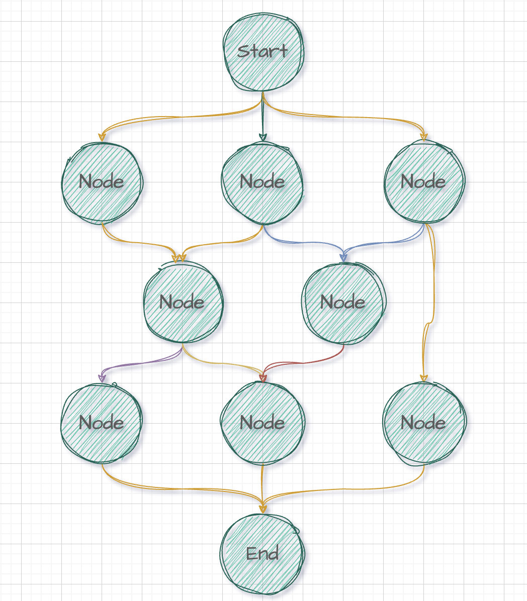
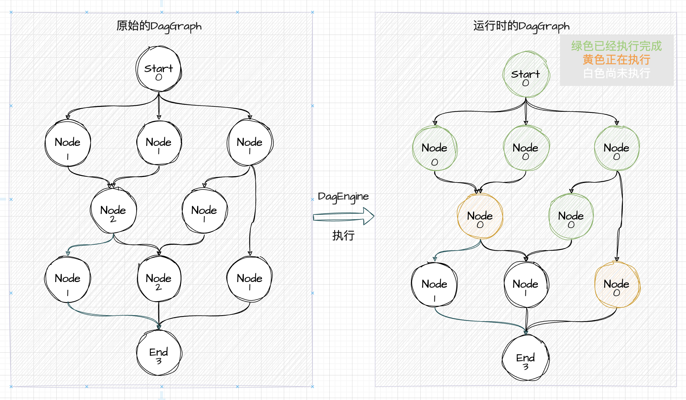
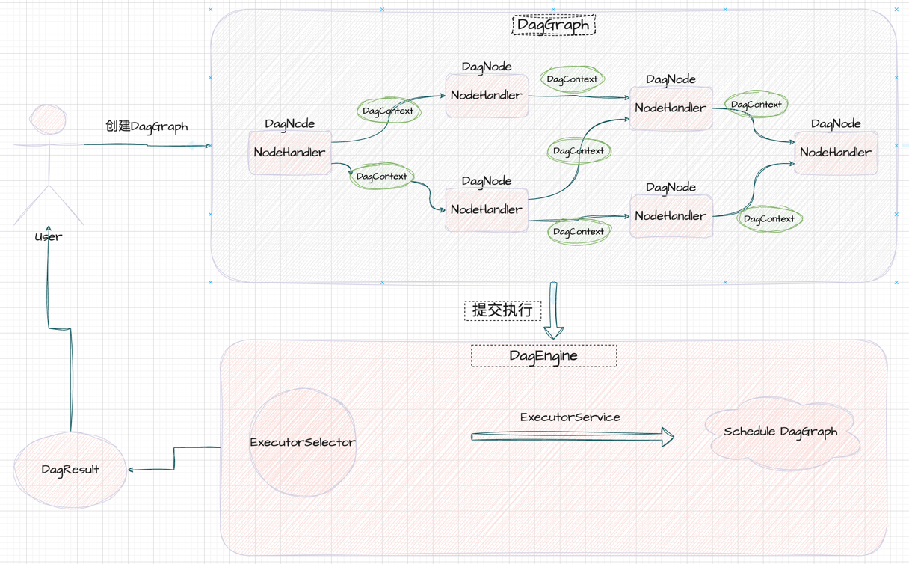

# Easy-Scheduler

## 介绍

一款基于有向无环图DAG(directed acyclic graph)的本地任务编排和调度执行器，设计目标是轻量、简单易用。

## 特点

- 轻量：注重轻量级设计，依赖少，保持高效性能
- 简单易用：提供简单直观的API
- 低侵入性：基于注解来定义和配置DAG，使得DAG的定义更加直观和简洁。
- 支持表达式：集成 Spring Expression Language（SpEL）以提供更灵活配置
- 支持文本配置：支持json、yaml格式内容动态创建DAG

## 核心设计

### Dag图的设计

为了简单，**Dag开始和结束，都会各自收敛成一个节点**。并且边是有权重的，用来表示节点的依赖类型（依赖程度）。

示例如下图所示，边使用不同的颜色，表示不同的权重。



### 节点任务驱动

任务的驱动使用Dag中节点的**入度信息（in-degree）**。
- 节点执行完成后，会将其子节点的入度减1
- 节点入度为0时，表示该节点可以执行

示例如下，一个是原始的DAG入度信息，一个是运行时的DAG入度的变化。



### 节点依赖类型

节点依赖有以下类型

- 强依赖（Strong）：依赖的节点必须执行成功
- 软依赖（Soft）：依赖的节点可以执行失败
- 虚依赖（Weak）：依赖的节点有一个执行完成便可以驱动当前节点（未实现）

依赖类型会转换成权重值存储到DagGraph中。

## 项目概览

### 项目模块说明

- easy-scheduler-core: 核心基础模块，定义节点
- easy-scheduler-reader：负责读取文本配置、注解配置
- easy-scheduler-spel：支持spel表达式
- easy-scheduler-dynamic：基于core、reader模块，提供动态构建Dag图的能力
- easy-scheduler-example：使用示例（待完善）

### 项目组件说明

核心基础组件

- NodeHandler：节点处理器，实际的业务处理逻辑
- DagNode：Dag图节点的定义，内包含对应的处理器，以及对其他节点依赖关系
- DagGraph：Dag图的抽象，是DagNode的集合，负责维护图的关系
- DagEngine：执行引擎，根据DagGraph进行调度执行
- ExecutorSelector：根据不同的DagGraph选择对应的线程池去执行
- DagContext：执行DagGraph的上下文信息
- DagResult：执行完成的结果，可以获取每个节点的执行状态和结果

辅助组件

- GraphDefinition、NodeDefinition：基础的Dag、节点定义
- DagGraphReader：读取文本配置内容、解析Class，转换成基础的GraphDefinition
- DagGraphFactory：将GraphDefinition定义转换成DagGraph实例，并且负责实现el表达式的转换和实现
- DynamicDagEngine：结合DagGraphFactory增强原始的DagEngine，提供动态构建图来执行的能力

核心组件的示意如下



## 使用示例

### 基础示例

基础示例也是原始的底层使用方式，只需要引用用 easy-scheduler-core 模块即可。
主要是创建各个组件

1. 创建NodeHandler（使用DefaultNodeHandler.builder()构建）
2. 创建DagNode（使用efaultDagNode.builder()构建）
3. 创建DagGraph（使用DagGraphBuilder()构建）
4. 创建DagEngine（提供并发实现ConcurrentDagEngine、单线程实现SingleThreadDagEngine）
5. 将DagGraph交给DagEngine执行，获取执行结果

创建NodeHandler

```java
NodeHandler printHandler=DefaultNodeHandler.builder()
        .handlerName("A")
        .when(context->context.getContext()!=null)
        .action((dagNode,dagContext)->{
        System.out.println("Hello: "+dagNode.getNodeName());
        return null;
        }).build();
```

创建DagNode, B节点依赖A节点

```java
DagNode dagNodeA=DefaultDagNode.builder().nodeName("A")
        .handler(printHandler).build();

        DagNode dagNodeB=DefaultDagNode.builder().nodeName("B")
        .handler(printHandler).dependOn("A").build();
```

构建DagGraph

```java
DagGraph dagGraph=new DagGraphBuilder()
        .graphName("helloGraph")
        .addNodes(dagNodeA,dagNodeB)
        .build();
```

构建DagEngine并执行

```java
DagEngine dagEngine=new ConcurrentDagEngine();
        dagEngine.fire(dagGraph,"your context");
```

### 注解配置使用

TODO

### 文本配置使用

TODO

### SpringBoot集成使用

引入starter即可完成和Springboot集成，starter主要完成下面的事情

- 创建各种组件作为spring bean，如`DagGraphReader`、`DagGraphFactory`、`DynamicDagEngine`等
- 将所有实现了`NodeHandler`的bean注册到到`DagGraphFactory`中
- 所有`@MethodNodeHandler`注释的方法，转换成`NodeHandler`并注册到`DagGraphFactory`中
- 获取配置的路径下所有标注`@GraphClass`注解的类，转换成`DagGraph`并注册到`GraphRegistry`中

基础配置, 配置扫描路径。可以不配置，支持运行时创建。

```yaml
easy-scheduler:
  scanGraphPackage: "org.gloryjie"
```

将需要的方法作为NodeHandler的加上注解 `@MethodNodeHandler`

```java
@MethodNodeHandler("getUserCourseListHandler")
public List<String> getCourseList(@ContextParam("uid") Integer uid){
        log.info("getUserCourseListHandler param: "+uid);
        return Lists.newArrayList("Math","Java","Go","Rust");
        }

@MethodNodeHandler("getUserCourseScoreHandler")
public List<UserInfoContext.Course>getCourseScoreList(@ContextParam("uid") Integer uid){
        List<UserInfoContext.Course>courseList=new ArrayList<>();
        courseList.add(new UserInfoContext.Course("Math",60));
        courseList.add(new UserInfoContext.Course("Java",70));
        return courseList;
        }

@MethodNodeHandler("getUserSimpleInfoHandler")
public UserInfoContext.UserInfo getUserSimpleInfoHandler(@ContextParam("uid") Integer uid){
        UserInfoContext.UserInfo userInfo=new UserInfoContext.UserInfo();
        userInfo.setName("Jack");
        userInfo.setAge(22);
        userInfo.setAddress("Shenzhen");
        return userInfo;
        }
```

在自定义的Context中使用`@GraphNode`、`@GraphClass`来描述节点依赖关系

```java

@GraphClass
@Data
public class UserInfoContext {

    private Integer uid;

    @GraphNode(handler = "getUserSimpleInfoHandler", dependsOn = {"uid"})
    private UserInfo userInfo;

    @GraphNode(handler = "getUserCourseListHandler", dependsOn = "uid")
    private List<String> courseList;

    @GraphNode(handler = "getUserCourseScoreHandler", dependsOn = "courseList")
    private List<Course> courseScoreList;
}
```

之后在需要的地方注入`DynamicDagEngine`实例，并执行

```java
UserInfoContext userInfoContext=new UserInfoContext();
        userInfoContext.setUid(123);

        DagResult dagResult=dynamicDagEngine.fireContext(userInfoContext);
        System.out.println(userInfoContext);
```


